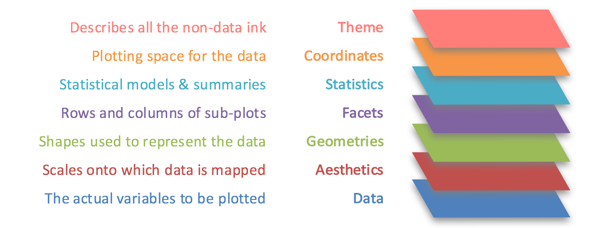

## 1. Overview
In this chapter, we will learn the basic principles and essential components of ggplot2, and gain hands-on experience on using these components to plot statistical graphics based on the principle of Layered Grammar of Graphics

By then end of this chapter, we will be able to apply the essential graphical elements provided by ggplot2 to create elegant and yet functional statistical graphics.

## 2 Getting Started
::: {.panel-tabset}
## Installing and loading libraries
The code chunk below uses p_load() of [pacman](https://rpubs.com/akshaypatankar/594834) package to check if tidyverse packages are installed in the computer. If they are, then they will be launched into R.
```{r}
pacman::p_load(tidyverse, patchwork)
```

## Importing Data
The code chunk below imports exam_data.csv into R environment by using read_csv() function of [readr](https://readr.tidyverse.org/) package. readr is one of the tidyverse package.
```{r}
#| code-fold: false
exam_data <- read_csv("data/Exam_data.csv")
```

## Understanding the Data

```{r}
#| code-fold: true
#| code-summary: "Show the code"
summary(exam_data)
```
* Year end examination grades of a cohort of primary 3 students from a local school.
* There are a total of seven attributes. Four of them are categorical data type and the other three are in continuous data type.
    * Categorical attributes are: ID, CLASS, GENDER and RACE.
    * Continuous attributes are: MATHS, ENGLISH and SCIENCE.
:::

## 3 R Graphics vs ggplot
::: {.panel-tabset}
## R Graphics
```{r}
#| code-fold: true
#| code-summary: "Show the code"
hist(exam_data$MATHS, 
     ylab='Number of Students', 
     xlab='Score', 
     main='Distribution of Maths scores',
     col='steelblue')
```
## ggplot2
```{r}
#| code-fold: true
#| code-summary: "Show the code"
ggplot(data=exam_data, aes(x = MATHS)) +
  geom_histogram(bins=10, 
                 boundary = 100,
                 color="black", 
                 fill="steelblue") +
  labs(x = "Score",
       y = "Number of Students",
       title = "Distribution of Maths scores")+
  theme_bw()+
  theme(plot.title = element_text(hjust = 0.5))
```
:::
ggplot2 is preferred over the built-in plot function due to the following reason:

“The transferable skills from ggplot2 are not the idiosyncrasies of plotting syntax, but a powerful way of thinking about visualisation, as a way of mapping between variables and the visual properties of geometric objects that you can perceive.” - Hadley Wickham

## 4 Grammar of Graphics
Grammar of Graphics, introduced by Leland Wilkinson (1999), is a general scheme for data visualization which breaks up graphs into semantic components such as scales and layers. It defines the rules of structuring mathematical and aesthetic elements into a meaningful graph.

**Layered Grammar of Graphics:**


* **Data**: The dataset being plotted.
* **Aesthetics**: Take attributes of the data and use them to influence visual characteristics, such as position, colours, size, shape, or transparency.
* **Geometrics**: The visual elements used for our data, such as point, bar or line. Facets split the data into subsets to create multiple variations of the same graph (paneling, multiple plots).
* **Statistics**: Statiscal transformations that summarise data (e.g. mean, confidence intervals).
* **Coordinate systems** define the plane on which data are mapped on the graphic.
* **Themes** modify all non-data components of a plot, such as main title, sub-title, y-aixs title, or legend background.


## 5 Essential Grammatical Elements in ggplot2: data() and aes()
::: {.panel-tabset}
## data
Let us call the ggplot() function using the code chunk below.
```{r}
ggplot(data=exam_data)
```
* A blank canvas appears.
* ggplot() initializes a ggplot object.
* The data argument defines the dataset to be used for plotting.
* If the dataset is not already a data.frame, it will be converted to one by fortify().

## aesthetics
The aesthetic mappings take attributes of the data and and use them to influence visual characteristics, such as position, colour, size, shape, or transparency. Each visual characteristic can thus encode an aspect of the data and be used to convey information.

All aesthetics of a plot are specified in the [aes()](https://ggplot2.tidyverse.org/reference/aes.html) function call.

Code chunk below adds the aesthetic element into the plot.
```{r}
ggplot(data=exam_data, aes(x=MATHS))
```
* ggplot includes the x-axis and the axis’s label
:::

## 6.Essential Grammatical Elements in ggplot2: geom 
### Geometric Objects in ggplot2 
Geometric objects are the actual marks we put on a plot, examples include:

* geom_point for drawing individual points (e.g., a scatter plot)
* geom_line for drawing lines (e.g., for a line charts)
* geom_smooth for drawing smoothed lines (e.g., for simple trends or approximations)
* geom_bar for drawing bars (e.g., for bar charts)
* geom_histogram for drawing binned values (e.g. a histogram)
* geom_polygon for drawing arbitrary shapes
* geom_map for drawing polygons in the shape of a map! (You can access the data to use for these maps by using the map_data() function).

A plot must have at least one geom; there is no upper limit. You can add a geom to a plot using the + operator.

For complete list, please refer to [here](https://ggplot2.tidyverse.org/reference/#section-layer-geoms).


::: {.panel-tabset}
## geom_bar
The code chunk below plots a bar chart by using [geom_bar()](https://ggplot2.tidyverse.org/reference/geom_bar.html).
```{r}
#| code-fold: true
#| code-summary: "Show the code"
ggplot(data = exam_data, 
       aes(x = reorder(RACE, RACE, function(x)-length(x)))) +
    geom_bar(color='darkgreen', fill='darkgreen')+
    ylim(0, 220) + 
    geom_text(stat="count", 
      aes(label=paste0(after_stat(count), ", ", 
      round(after_stat(count)/sum(after_stat(count))*100, 1), "%")),
      vjust=-1) +
    labs(x = "Race",
         y = "No. of\nStudents",
         title = "Number of Students by Race") + 
    theme_bw() +
    theme(
      axis.title.y = element_text(hjust=1, angle=0),
      plot.background=element_rect(fill="#e5ebda",colour="#c0c2be")
    ) 
```
## geom_dotplot
In a dot plot, the width of a dot corresponds to the bin width (or maximum width, depending on the binning algorithm), and dots are stacked, with each dot representing one observation.

In the code chunk below, [geom_dotplot()](https://ggplot2.tidyverse.org/reference/geom_dotplot.html) of ggplot2 is used to plot a dot plot.
```{r}
#| code-fold: true
#| code-summary: "Show the code"
ggplot(data=exam_data, aes(x = MATHS)) +
  geom_dotplot(dotsize=0.5, fill='orchid') +
  labs(x="Math Scores in Exams", y="count", title="Frequency Distribution of Math Scores")+
  theme_light() +
  labs(caption = "Each dot represents 1 student")
```
* The y scale is not very useful, in fact it is very misleading.

The code chunk below performs the following two steps:

* scale_y_continuous() is used to turn off the y-axis, and
* binwidth argument is used to change the binwidth to 2.5.
```{r}
#| code-fold: true
#| code-summary: "Show the code"
ggplot(data=exam_data,aes(x=MATHS)) +
  geom_dotplot(dotsize=0.5, fill='orchid') +
  labs(x="Math Scores in Exams", y="count", title="Frequency Distribution of Math Scores")+
  theme_light() +
  scale_y_continuous(NULL, breaks = NULL)  +
  labs(caption = "Each dot represents 1 student")
```

## geom_histogram

### A Basic Histogram
In the code chunk below, [geom_histogram()](https://ggplot2.tidyverse.org/reference/geom_histogram.html) is used to create a simple histogram by using values in MATHS field of exam_data.
```{r}
#| code-fold: true
#| code-summary: "Show the code"
ggplot(data=exam_data,aes(x = MATHS)) +
  geom_histogram()
```
### Modifying a geometric object by changing geom()
In the code chunk below,

* bins argument is used to change the number of bins to 20,
* fill argument is used to shade the histogram with light blue color, and
* color argument is used to change the outline colour of the bars in black
```{r}
#| code-fold: true
#| code-summary: "Show the code"
ggplot(data=exam_data, aes(x= MATHS)) +
  geom_histogram(bins=20,            
                 color="black",      
                 fill="light blue")  
```

### Modifying a geometric object by changing aes()
* The code chunk below changes the interior colour of the histogram (i.e. fill) by using sub-group of aesthetic().
```{r}
#| code-fold: true
#| code-summary: "Show the code"
ggplot(data=exam_data, 
       aes(x= MATHS, 
           fill = GENDER)) +
  geom_histogram(bins=20, 
                 color="grey30")
```

## geom_density
[geom-density()](https://ggplot2.tidyverse.org/reference/geom_density.html) computes and plots [kernel density estimate](https://en.wikipedia.org/wiki/Kernel_density_estimation), which is a smoothed version of the histogram.

It is a useful alternative to the histogram for continuous data that comes from an underlying smooth distribution.

### A Basic geom_density Plot
The code below plots the distribution of Maths scores in a kernel density estimate plot.
```{r}
#| code-fold: true
#| code-summary: "Show the code"
ggplot(data=exam_data, aes(x = MATHS)) +
  geom_density()           
```

### Two Kernel Density Lines
The code chunk below plots two kernel density lines by using colour or fill arguments of aes()
```{r}
#| code-fold: true
#| code-summary: "Show the code"
ggplot(data=exam_data, aes(x = MATHS, colour = GENDER)) +
  geom_density()
```

## geom_boxplot
[geom_boxplot()](https://ggplot2.tidyverse.org/reference/geom_boxplot.html) displays continuous value list. It visualises five summary statistics (the median, two hinges and two whiskers), and all “outlying” points individually.

### A Basic geom_boxplot
The code chunk below plots boxplots by using [geom_boxplot()](https://ggplot2.tidyverse.org/reference/geom_boxplot.html).
```{r}
#| code-fold: true
#| code-summary: "Show the code"
ggplot(data=exam_data, 
       aes(y = MATHS,       
           x= GENDER)) +    
  geom_boxplot() 
```

### A notched geom_boxplot
Notches are used in box plots to help visually assess whether the medians of distributions differ. If the notches do not overlap, this is evidence that the medians are different.

The code chunk below plots the distribution of Maths scores by gender in notched plot instead of boxplot.
```{r}
#| code-fold: true
#| code-summary: "Show the code"
ggplot(data=exam_data, aes(y = MATHS, x= GENDER)) +
  geom_boxplot(notch=TRUE)
```

## geom_violin
[geom_violin](https://ggplot2.tidyverse.org/reference/geom_violin.html) is designed for creating violin plot. Violin plots are a way of comparing multiple data distributions. With ordinary density curves, it is difficult to compare more than just a few distributions because the lines visually interfere with each other. With a violin plot, it’s easier to compare several distributions since they’re placed side by side.

The code below plot the distribution of Maths score by gender in violin plot.
```{r}
#| code-fold: true
#| code-summary: "Show the code"
ggplot(data=exam_data, 
       aes(y = MATHS, 
           x= GENDER)) +
  geom_violin()
```

## geom_point
[geom_point()](https://ggplot2.tidyverse.org/reference/geom_point.html) is especially useful for creating scatterplot.

The code chunk below plots a scatterplot showing the Maths and English grades of pupils by using geom_point().
```{r}
#| code-fold: true
#| code-summary: "Show the code"
ggplot(data=exam_data, 
       aes(x= MATHS, 
           y=ENGLISH)) +
  geom_point() 
```

## fusion
### geom objects can be combined
The code chunk below plots the data points on the boxplots by using both geom_boxplot() and geom_point().
```{r}
#| code-fold: true
#| code-summary: "Show the code"
ggplot(data=exam_data, aes(y = MATHS, x= GENDER)) +
  geom_boxplot() +                    
  geom_point(position="jitter", 
             size = 0.5)
```

:::

## 7. Essential Grammatical Elements in ggplot2: stat
The [Statistics functions](https://ggplot2.tidyverse.org/reference/index.html#stats) statistically transform data, usually as some form of summary. For example:

* frequency of values of a variable (bar graph)
    * a mean
    * a confidence limit
* There are two ways to use these functions:
    * add a stat_() function and override the default geom, or
    * add a geom_() function and override the default stat.
    

::: {.panel-tabset}
## stat()
### Working with stat()
The boxplots below are incomplete because the positions of the means were not shown.
```{r}
ggplot(data=exam_data, aes(y = MATHS, x= GENDER)) +
  geom_boxplot()
```
## stat_summary()
### Working with stat - the stat_summary() method
The code chunk below adds mean values by using [stat_summary()](https://ggplot2.tidyverse.org/reference/stat_summary.html) function and overriding the default geom.
```{r}
#| code-fold: true
#| code-summary: "Show the code"
ggplot(data=exam_data, 
       aes(y = MATHS, x= GENDER)) +
  geom_boxplot() +
  stat_summary(geom = "point",       
               fun = "mean",         
               colour ="red",        
               size=4)    
```

## geom()
### Working with stat - the geom() method
The code chunk below adding mean values by using geom_() function and overriding the default stat.
```{r}
#| code-fold: true
#| code-summary: "Show the code"
ggplot(data=exam_data, 
       aes(y = MATHS, x= GENDER)) +
  geom_boxplot() +
  geom_point(stat="summary",        
             fun="mean",           
             colour="red",          
             size=4)          
```
## curve + scatter
### Adding a best fit curve on a scatterplot
The scatterplot below shows the relationship of Maths and English grades of pupils. The interpretability of this graph can be improved by adding a best fit curve.

In the code chunk below, [geom_smooth()](https://ggplot2.tidyverse.org/reference/geom_smooth.html) is used to plot a best fit curve on the scatterplot.
```{r}
#| code-fold: true
#| code-summary: "Show the code"
ggplot(data=exam_data, 
       aes(x= MATHS, y=ENGLISH)) +
  geom_point() +
  geom_smooth(size=0.5)
```

The default method used is loess.

The default smoothing method can be overridden as shown below.
```{r}
#| code-fold: true
#| code-summary: "Show the code"
ggplot(data=exam_data, 
       aes(x= MATHS, 
           y=ENGLISH)) +
  geom_point() +
  geom_smooth(method=lm, 
              linewidth=0.5)
```
:::

## 8. Essential Grammatical Elements in ggplot2: Facets
Facetting generates small multiples (sometimes also called trellis plot), each displaying a different subset of the data. They are an alternative to aesthetics for displaying additional discrete variables. ggplot2 supports two types of factes, namely: [facet_grid()](https://ggplot2.tidyverse.org/reference/facet_grid.html) and [facet_wrap](https://ggplot2.tidyverse.org/reference/facet_wrap.html).

::: {.panel-tabset}
## facet_wrap()
### Working with facet_wrap()
[facet_wrap](https://ggplot2.tidyverse.org/reference/facet_wrap.html) wraps a 1d sequence of panels into 2d. This is generally a better use of screen space than facet_grid because most displays are roughly rectangular.

The code chunk below plots a trellis plot using facet-wrap().
```{r}
#| code-fold: true
#| code-summary: "Show the code"
ggplot(data=exam_data, aes(x= MATHS)) +
  geom_histogram(bins=20) +
    facet_wrap(~ CLASS)
```
## facet_grid()
### facet_grid() function
[facet_grid()](https://ggplot2.tidyverse.org/reference/facet_grid.html) forms a matrix of panels defined by row and column facetting variables. It is most useful when you have two discrete variables, and all combinations of the variables exist in the data.

The code chunk below plots a trellis plot using facet_grid().
```{r}
#| code-fold: true
#| code-summary: "Show the code"
ggplot(data=exam_data, aes(x= MATHS)) +
  geom_histogram(bins=20) +
    facet_grid(~ CLASS)
```
:::

## 9. Essential Grammatical Elements in ggplot2: Coordinates
The Coordinates functions map the position of objects onto the plane of the plot. There are a number of different possible coordinate systems to use, they are:

* [`coord_cartesian()`](https://ggplot2.tidyverse.org/reference/coord_cartesian.html): the default cartesian coordinate systems, where you specify x and y values (e.g. allows you to zoom in or out).
* [`coord_flip()`](https://ggplot2.tidyverse.org/reference/coord_flip.html): a cartesian system with the x and y flipped.
* [`coord_fixed()`](https://ggplot2.tidyverse.org/reference/coord_fixed.html): a cartesian system with a "fixed" aspect ratio (e.g. 1.78 for a "widescreen" plot).
* [`coord_quickmap()`](https://ggplot2.tidyverse.org/reference/coord_map.html): a coordinate system that approximates a good aspect ratio for maps.

::: {.panel-tabset}
## coord()
### Working with Coordinate
By the default, the bar chart of ggplot2 is in vertical form.
```{r}
#| code-fold: true
#| code-summary: "Show the code"
ggplot(data=exam_data, aes(x=RACE)) +
  geom_bar()
```
## coord_flip()
### Using coord_flip()
The code chunk below flips the horizontal bar chart into vertical bar chart by using coord_flip().

```{r}
#| code-fold: true
#| code-summary: "Show the code"
ggplot(data=exam_data, aes(x=RACE)) +
  geom_bar() +
  coord_flip()
```

## change x,y range
### Changing the y- and x-axis range
The scatterplot on the right is slightly misleading because the y-aixs and x-axis range are not equal.
```{r}
#| code-fold: true
#| code-summary: "Show the code"
ggplot(data=exam_data, 
       aes(x= MATHS, y=ENGLISH)) +
  geom_point() +
  geom_smooth(method=lm, size=0.5)
```

The code chunk below fixed both the y-axis and x-axis range from 0-100.
```{r}
#| code-fold: true
#| code-summary: "Show the code"
ggplot(data=exam_data, aes(x= MATHS, y=ENGLISH)) +
  geom_point() +
  geom_smooth(method=lm, size=0.5) +  
  coord_cartesian(xlim=c(0,100), ylim=c(0,100))
```
:::

## 10. Essential Grammatical Elements in ggplot2: themes
Themes control elements of the graph not related to the data. For example:
* background colour
* size of fonts
* gridlines
* colour of labels

Built-in themes include:
* theme_gray() (default) 
* theme_bw() 
* theme_classic()

A list of theme can be found at this [link](https://ggplot2.tidyverse.org/reference/ggtheme.html). Each theme element can be conceived of as either a line (e.g. x-axis), a rectangle (e.g. graph background), or text (e.g. axis title).

::: {.panel-tabset}
## theme_gray()
### Working with theme 
The code chunk below plot a horizontal bar chart using theme_gray().
```{r}
#| code-fold: true
#| code-summary: "Show the code"
ggplot(data=exam_data, aes(x=RACE)) +
  geom_bar() +
  coord_flip() +
  theme_gray()
```
## theme_classic()
A horizontal bar chart plotted using theme_classic().
```{r}
#| code-fold: true
#| code-summary: "Show the code"
ggplot(data=exam_data, aes(x=RACE)) +
  geom_bar() +
  coord_flip() +
  theme_classic()
```

## theme_minimal()
A horizontal bar chart plotted using theme_minimal().
```{r}
#| code-fold: true
#| code-summary: "Show the code"
ggplot(data=exam_data, aes(x=RACE)) +
  geom_bar() +
  coord_flip() +
  theme_minimal()
```

## theme_light()
A horizontal bar chart plotted using theme_light().
```{r}
#| code-fold: true
#| code-summary: "Show the code"
ggplot(data=exam_data, aes(x=RACE)) +
  geom_bar() +
  coord_flip() +
  theme_light() +
      theme(plot.background=element_rect(fill="#f5f5f5",colour="#f5f5f5"))
```

## theme_bw()
A horizontal bar chart plotted using theme_bw().
```{r}
#| code-fold: true
#| code-summary: "Show the code"
ggplot(data=exam_data, aes(x=RACE)) +
  geom_bar() +
  coord_flip() +
  theme_bw() +
      theme(plot.background=element_rect(fill="#f5f5f5",colour="#f5f5f5"))
```
:::

## 11. Reference
* Kam, T.S. (2023). [A Layered Grammar of Graphics: ggplot2 methods](https://r4va.netlify.app/chap01).

* Hadley Wickham (2023) ggplot2: [Elegant Graphics for Data Analysis. Online 3rd edition](https://ggplot2-book.org/).

* Winston Chang (2013) [R Graphics Cookbook 2nd edition. Online version](https://r-graphics.org/).

* Healy, Kieran (2019) Data Visualization: [A practical introduction. Online version](https://socviz.co/).

* [Learning ggplot2 on Paper – Components](https://henrywang.nl/learning-ggplot2-on-paper-components/)

* [Learning ggplot2 on Paper – Layer](https://henrywang.nl/learning-ggplot2-on-paper-layer/)

* [Learning ggplot2 on Paper – Scale](https://henrywang.nl/tag/learning-ggplot2-on-paper/)

---

## 
